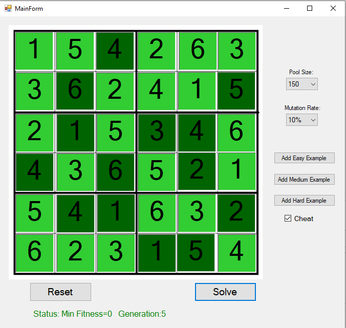

# 6x6 Sudoku Solver- Genetic Algorithms

## Project Description

The software can solve difficult 6x6 Sudoku puzzles in a matter of seconds using Genetic Algorithms techniques.
It was done as a final project for my AI course in Braude.

The project uses:
* C++ as a coding language
* Windows Forms for GUI

## GUI 

*Pool Size- Size of population of each generation in the genetic algorithm.

*Mutation Rate- Percent of offspring to be mutated in each step.

*Add Easy/Medium/Hard Example Buttons- Load a puzzle of the selected level for testing (to avoid inserting puzzle just for testing).

*Cheat Check Box- Adds additional constraints while performing mutation and creating a random pool, left as optional because easy examples are solved too fast when this option is on. Recommended for harder puzzles.

*Reset Button- Clear the board.

*Solve Button- Start the calculations proccess.

## Requirements for running
*Microsoft .NET Framework needs to be installed in order to run this C++/CLI exe file.
*The project is the folder called Sudoku.
*The executable is located at "Sudoku/Release/Sudoku.exe".
